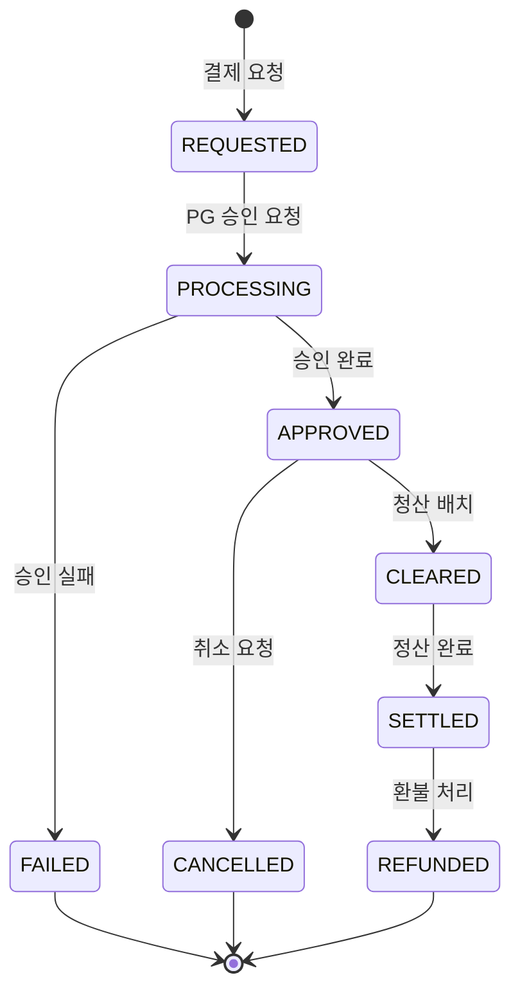
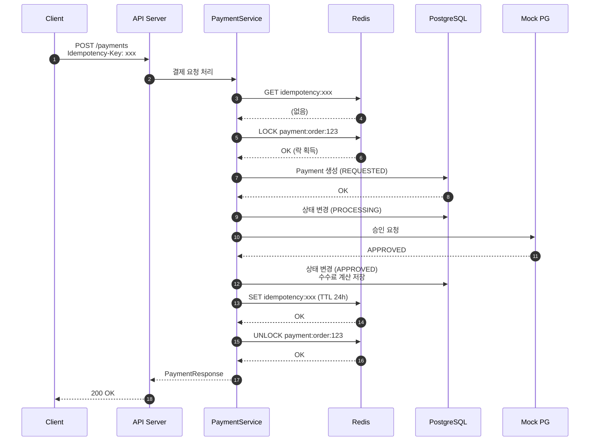
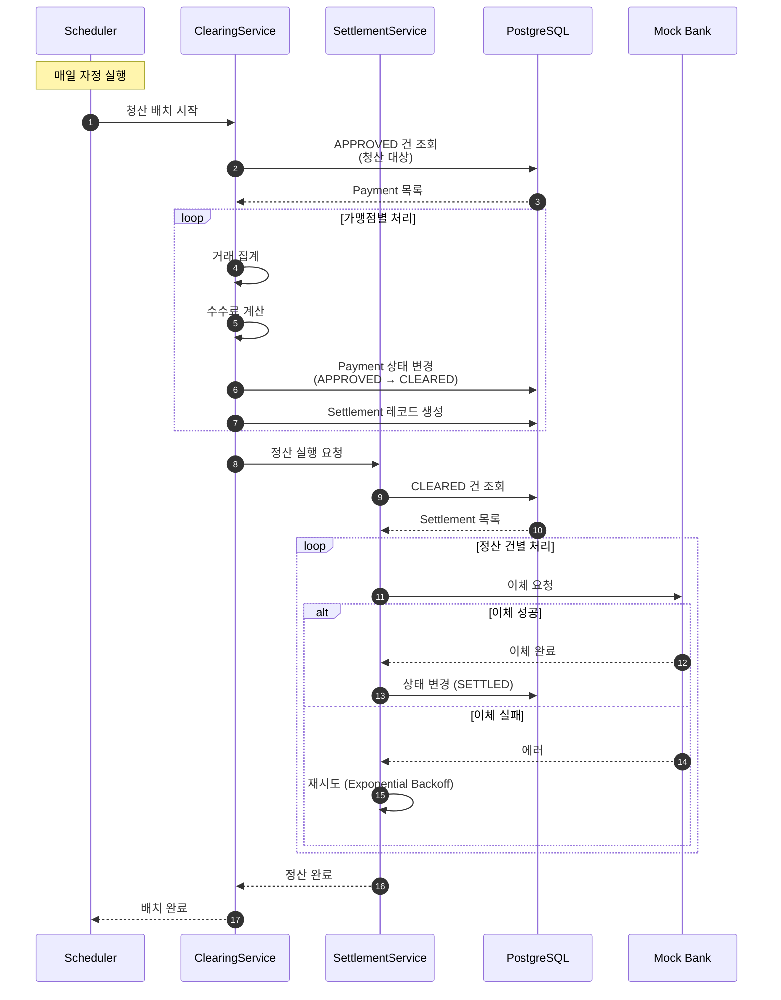
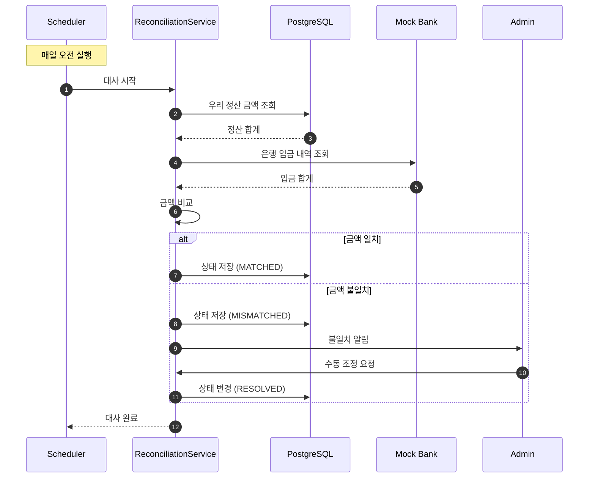
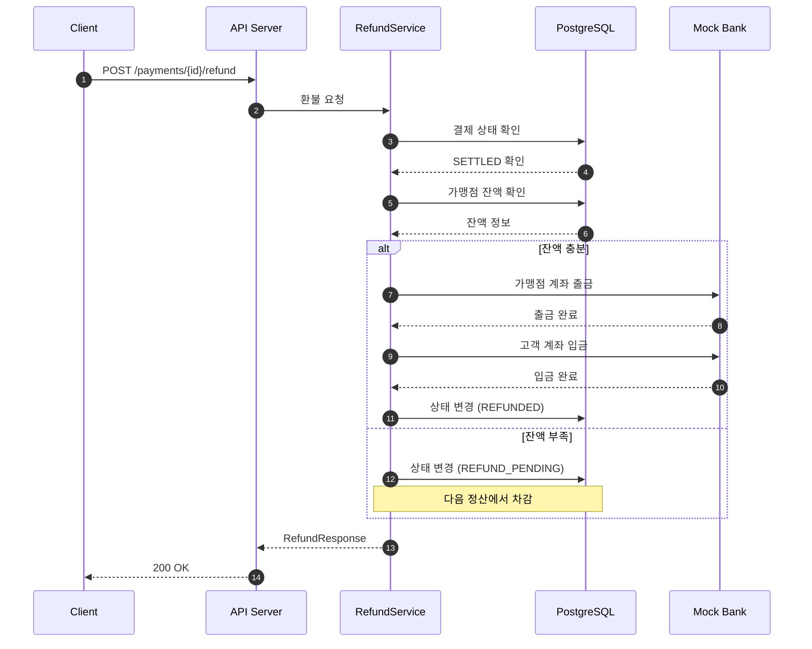
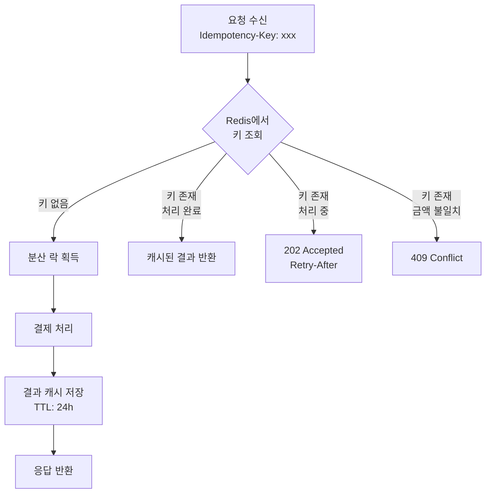
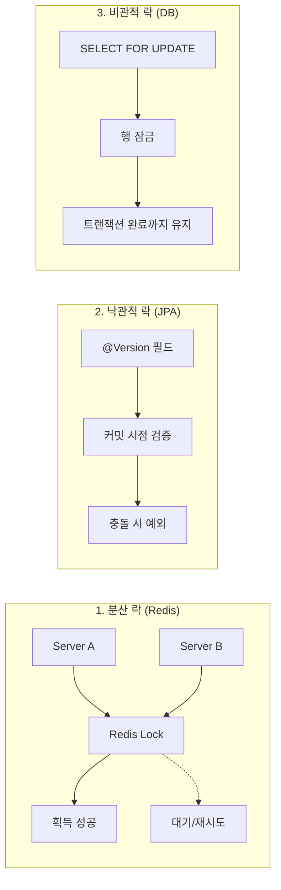
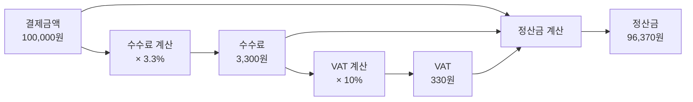
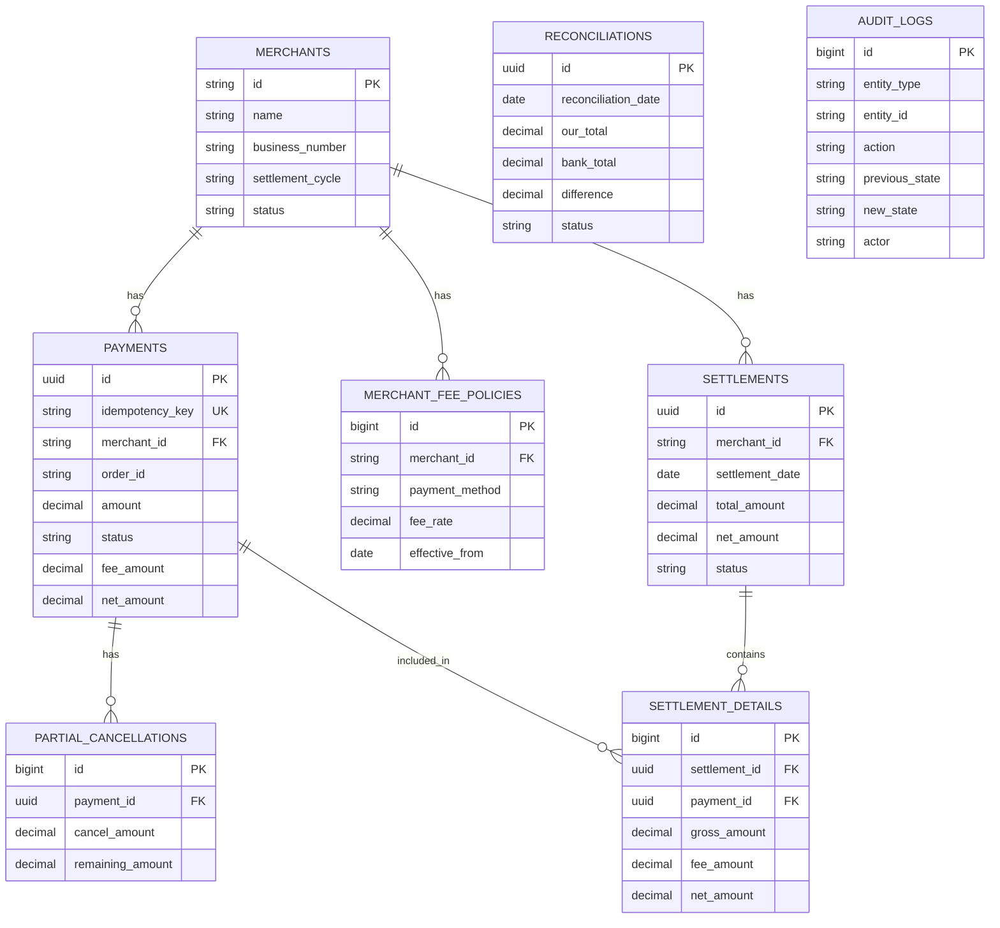

# PayFlow 시스템 아키텍처

> 결제 → 청산 → 정산 전체 흐름

---

## 1. 시스템 구성도

```
┌─────────────────────────────────────────────────────────────────────────────┐
│                              PayFlow System                                  │
├─────────────────────────────────────────────────────────────────────────────┤
│                                                                             │
│  ┌─────────┐     ┌─────────────┐     ┌─────────────────┐     ┌──────────┐  │
│  │ Client  │────▶│ API Gateway │────▶│ Payment Service │────▶│ Mock PG  │  │
│  └─────────┘     └─────────────┘     └─────────────────┘     └──────────┘  │
│                        │                      │                             │
│                        ▼                      ▼                             │
│                 ┌────────────┐         ┌────────────┐                       │
│                 │   Redis    │         │ PostgreSQL │                       │
│                 │ (분산 락)   │         │  (ACID)    │                       │
│                 └────────────┘         └────────────┘                       │
│                                              │                              │
│                        ┌─────────────────────┴─────────────────────┐        │
│                        ▼                                           ▼        │
│                ┌───────────────┐                          ┌───────────────┐ │
│                │   Clearing    │◀── Scheduler (자정) ──▶  │    Audit      │ │
│                │   Service     │                          │   Service     │ │
│                └───────────────┘                          └───────────────┘ │
│                        │                                                    │
│                        ▼                                                    │
│                ┌───────────────┐     ┌────────────┐                         │
│                │  Settlement   │────▶│ Mock Bank  │                         │
│                │   Service     │     └────────────┘                         │
│                └───────────────┘                                            │
│                        │                                                    │
│                        ▼                                                    │
│                ┌───────────────┐                                            │
│                │Reconciliation │                                            │
│                │   Service     │                                            │
│                └───────────────┘                                            │
│                                                                             │
└─────────────────────────────────────────────────────────────────────────────┘
```

---

## 2. 결제 상태 흐름 (State Machine)



---

## 3. 결제 처리 시퀀스 (Payment Flow)



---

## 4. 청산/정산 배치 시퀀스 (Clearing & Settlement)



---

## 5. 정산 대사 시퀀스 (Reconciliation)



---

## 6. 역정산 시퀀스 (Refund after Settlement)



---

## 7. 멱등성 처리 흐름



---

## 8. 동시성 제어 전략



---

## 9. 수수료 계산 흐름



---

## 10. ERD (Entity Relationship Diagram)



---

**— End of Document —**
